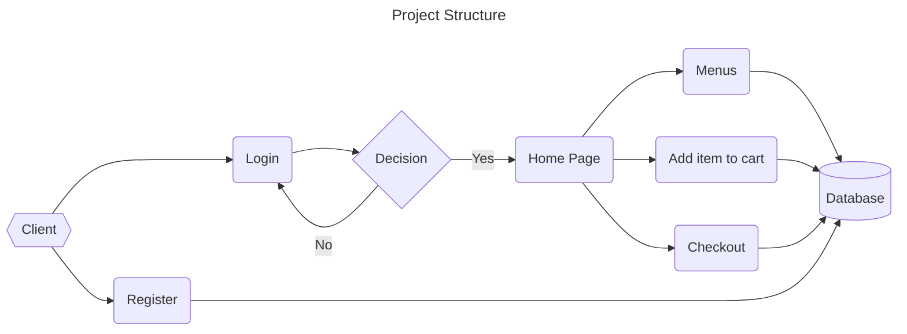

# Spork 

```mermaid
---
title: Project Structure
---
flowchart LR
  id1{{Client}} 
  id2(Register)
  id3(Login)
  id4{Decision}
  id5(Home Page)
  id6(Menus)
  id7(Add item to cart)
  id8(Checkout)
  id9[(Database)]
  id1-->id2
  id1-->id3
  id3-->id4-->|Yes|id5
  id4-->|No|id3
  id5-->id6 & id7 & id8--> id9
  id2------>id9
```

