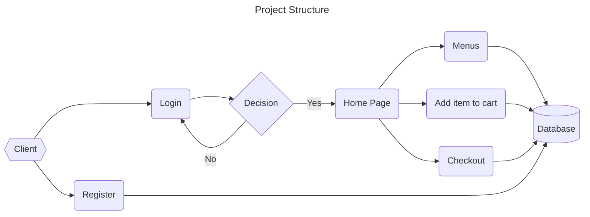
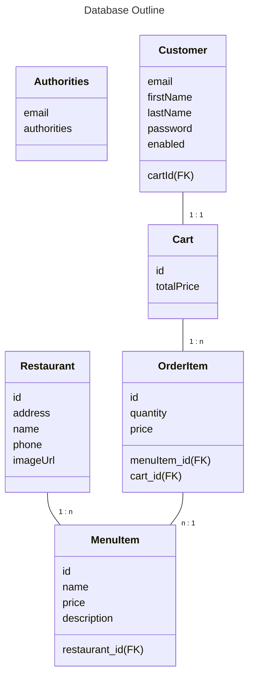

# Spork 

```mermaid
---
title: Project Structure
---
flowchart LR
  id1{{Client}} 
  id2(Register)
  id3(Login)
  id4{Decision}
  id5(Home Page)
  id6(Menus)
  id7(Add item to cart)
  id8(Checkout)
  id9[(Database)]
  id1-->id2
  id1-->id3
  id3-->id4-->|Yes|id5
  id4-->|No|id3
  id5-->id6 & id7 & id8--> id9
  id2------>id9
```

```mermaid
---
title: Database Outline
---
classDiagram
  class Authorities {
    email
    authorities
  }
  class Customer {
    email
    firstName
    lastName
    password
    enabled
    cartId(FK)
  }
  class Cart {
    id
    totalPrice
  }
  class OrderItem {
    id
    quantity
    price
    menuItem_id(FK)
    cart_id(FK)
  }
  class MenuItem {
    id
    name
    price
    description
    restaurant_id(FK)
  }
  class Restaurant {
    id
    address
    name
    phone
    imageUrl
  }  
  Cart -- "1 : n" OrderItem
  Restaurant -- "1 : n" MenuItem
  Customer -- "1 : 1" Cart 
  OrderItem -- "n : 1" MenuItem
```

